# 构建教程

!!! Warning

    本文主要针对 Windows 用户，Unix 用户（如 MacOS、Linux）的操作可能不一样。

## Step 1 下载

首先你需要有一个 `python`。如果你没有，去[官网](https://python.org)下一个吧。

下载以后，打开终端，运行 `pip install mkdocs`。

??? tips

    如果你下载失败了，可以尝试开个梯子。

## Step 2 新建项目

用终端打开你想要创建项目的路径，然后 `mkdocs new (文件夹名)`。

然后在 `路径/文件夹名` 下会出现：

```
+ docs
  - index.md
- mkdocs.ymal
```

此时 `cd 文件夹名`，然后运行 `mkdocs serve`，并访问 <https://localhost:8000>，然后你就可以看到文章页面了。

## Step 3 完善你的博客

### Step 3.1 新建文件

你可以在 `docs` 文件夹目录下新建文件。

新建文件会自动识别，保存的文件也会自动识别。

此时你刷新一下浏览器，你会发现多了一个文件。

### Step 3.2 分类文件

文件多了肯定要分类。

以下以此 `docs` 文件夹举例文件分类：

```
+ docs
  - index.md
  - About.md
  + Project
    - Project1.md
    - Project2.md
```

此时打开 `mkdocs.ymal`，找到 `nav:` 并替换为以下内容：

```
nav:
  - 主页: index.md
  - 关于: About.md
  - 项目:
    - 项目一: Project/Project1.md
    - 项目二: Project/Project2.md
```

然后重新加载浏览器，上方标签增加了：

```
| 主页 | 关于 | 项目 |
```

点击“主页”，就会来到 `index.md`。

点击“项目”，左边栏长这样：

```
项目
项目一
项目二
```

你还可以嵌套。如：

```
nav:
  - 1:
    - 2:
      - 333: 333.md
```

那么打开 `1` 以后会是这样：

```
1
2 v
  333
```

## Step 4 上传到 Github

### Step 4.1 Github 端

1. 创建一个 GitHub 账号。

2. 创建一个存储库。

    把存储库命名为 `你的用户名.gihub.io`。

    ??? 图片操作示例 info

        首先来到你的个人主页，然后点击“+”-“New repository”。

        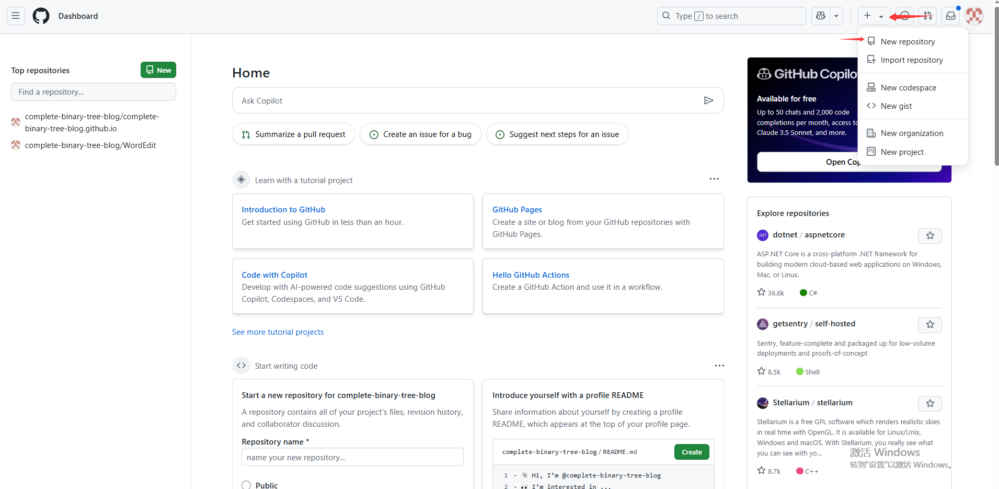

        然后将**存储库名字**改成 `你的用户名.github.io` 的形式，并点击“Create repository”创建存储库。**注意，必须是你的用户名**。

        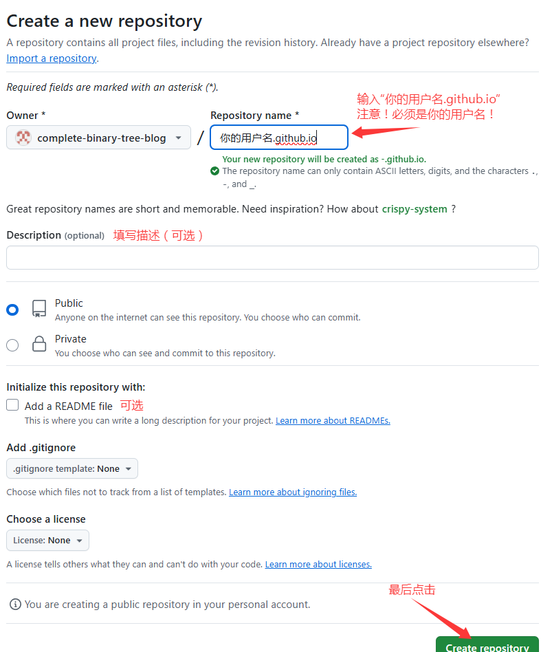

        最后你就会到你这个存储库的主页。

3. 复制存储库 `URL` 以备复制。

    ??? 图片操作示例 info

        书接上回，首先你要找到你的存储库的主页。

        点击“Code”按钮的下拉箭头，然后点击复制图标。

        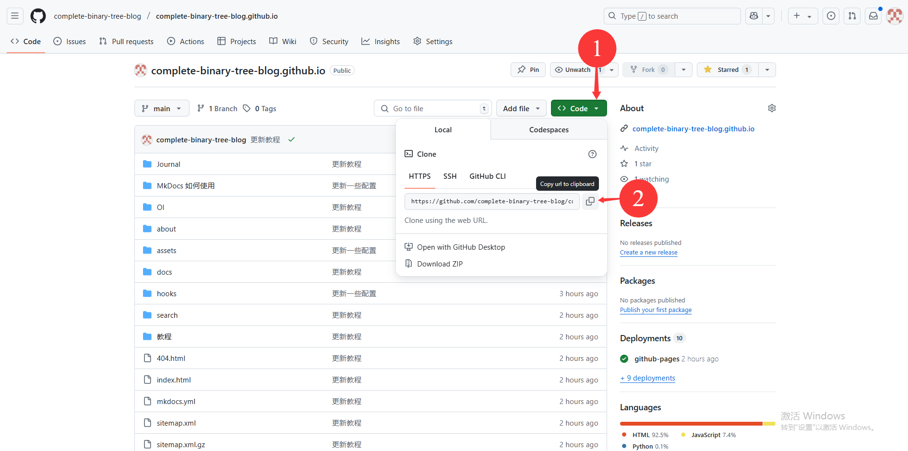

### Step 4.2 本地

1. 随便找个有克隆功能的软件把这个存储库克隆下来。

    ??? 你可能需要的软件 tips
        
        [Git](https://git-scm.com/downloads/win)

        [VS Code](https://code.visualstudio.com/) 或 [Github Desktop](https://desktop.github.com/download/)（前者有时候没办法上传，需要后者帮忙）

    ???+ tips "操作步骤"

        === "GitHub Desktop"

            首先点击左上角 `File` 选项，点击 `Copy repository`。

            选择 `URL` 选项，把你刚刚复制的储存库 `URL` 粘贴到第一个框，并在第二个框输入要保存到的位置。

            

            然后等待一会，即可下载完成。
      
        === "VS Code"

            首先点击左侧边栏第三个按钮，然后点击“更改”旁边的“...”，点击“克隆”。

            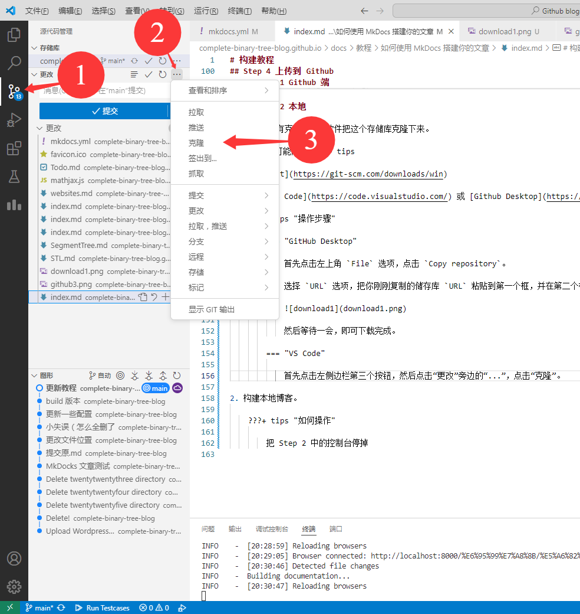

            然后上方会出现一个框，点击“从 GitHub 克隆”。

            

            然后输入你的仓库名称。（如果你有登录 GitHub，也可以只写在下面选择）

            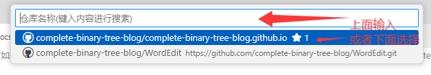

            最后选择保存文件夹，并等待它下载完成。

2. 构建本地博客。

    ???+ tips "如何操作"
        
        把 Step 2 中的控制台停掉。可以输入 <kbd>Ctrl</kbd>+<kbd>C</kbd> 来停止。

        然后输入 `mkdocs build`。

        待执行完成后，目录下会多一个 `site` 文件夹。

        将里面的内容复制到刚刚克隆到的文件夹里（**注意**：`site` 文件夹不要复制！）

3. 提交更改。

    ???+ tips "如何上传"

        === "Github Desktop"

            上传比下载方便多了！

            只需要在左下方填写更改标题、更改描述，然后点击 `commit`。

            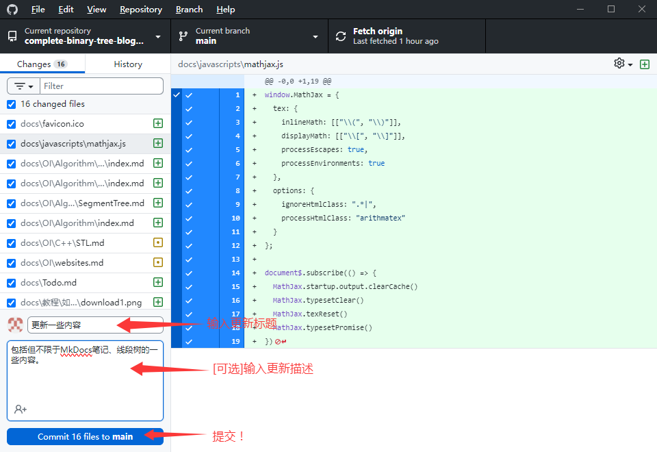

            接着，你可以点击右侧 `push origin` 直接上传到 GitHub，也可以攒几次 `commit` 再上传。**注意，在 `push origin 之前更改都只会保存在本地**！

            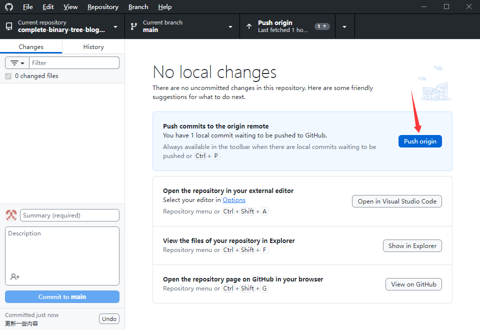

            ??? Warning

                请看清楚**你 `commit` 的是哪个项目**！~~不过 `commit` 是可以撤回的~~

                更改当前项目：点击左上角，选择即可。

                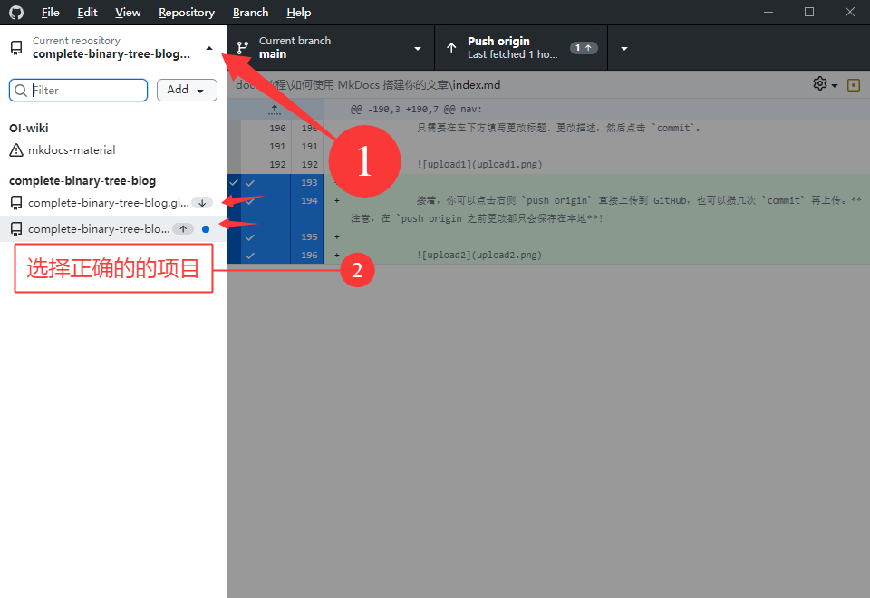

        === "VS Code"

            还是刚刚那个界面，点击“提交”（“commit”），在弹出来的窗口点击“是”（“Yes”）。

            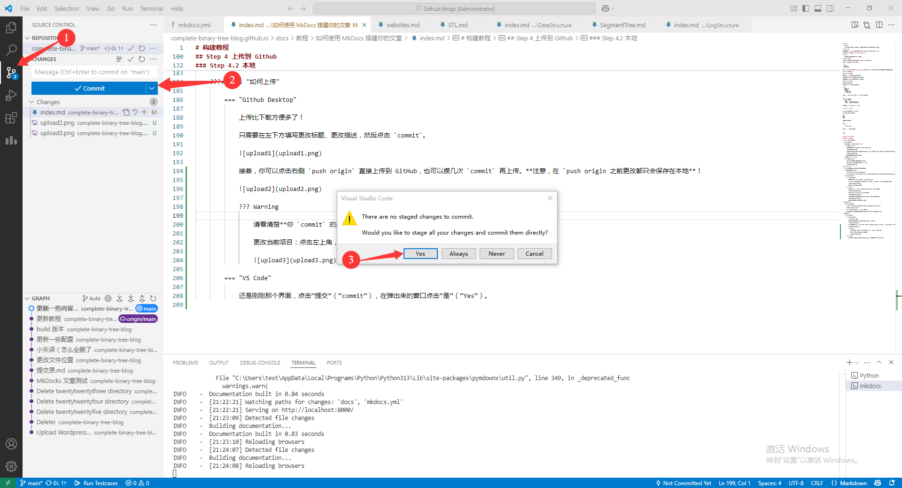

            然后输入更改标题，并点击右上角的勾。

            

            最后点击“同步更新”（“Sync Changes”）按钮上传。

            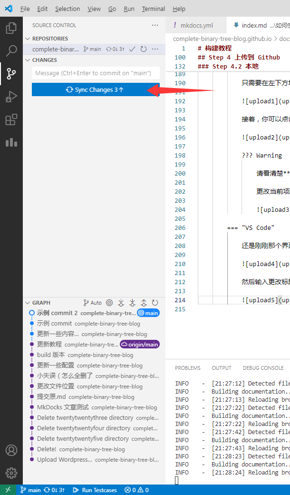

            大功告成！

## Step 5 设置你的 GitHub Page

回到你的 GitHub 存储库主页。

此时你会发现你的存储库多了一些内容。

此时点击 `Settings`，点击左侧的 `Page`，并在右侧的 `Build and deployment/Source` 的下拉箭头中选中 `Deploy from a branch` 按钮。

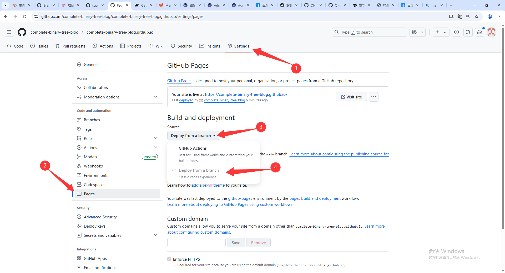

此时浏览器会刷新。然后在它下面的 `Branch` 选中 `main/(root)`。

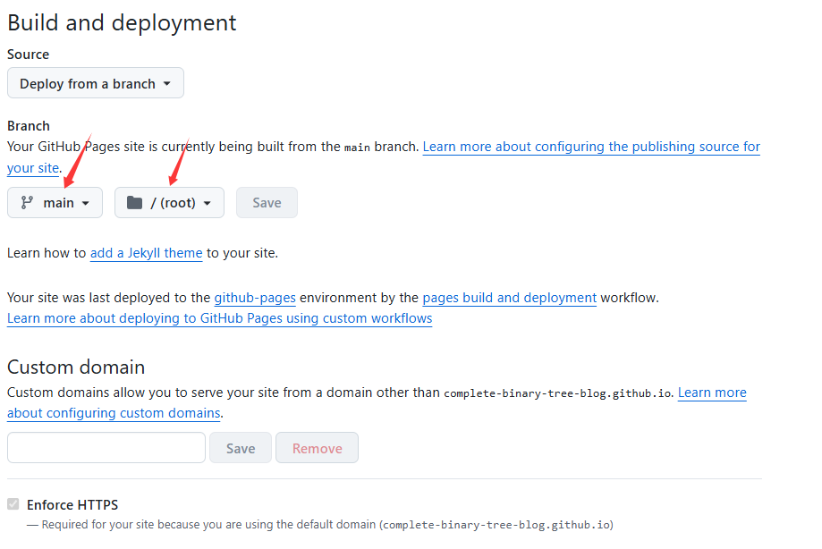

然后点击旁边的 `Save`（如果它没被禁用）。大功告成！

此时你需要等一会（最多 $10$ 分钟）。当你看到 `Your site is live at https://你的用户名.github.io` 的时候，点击那个链接。

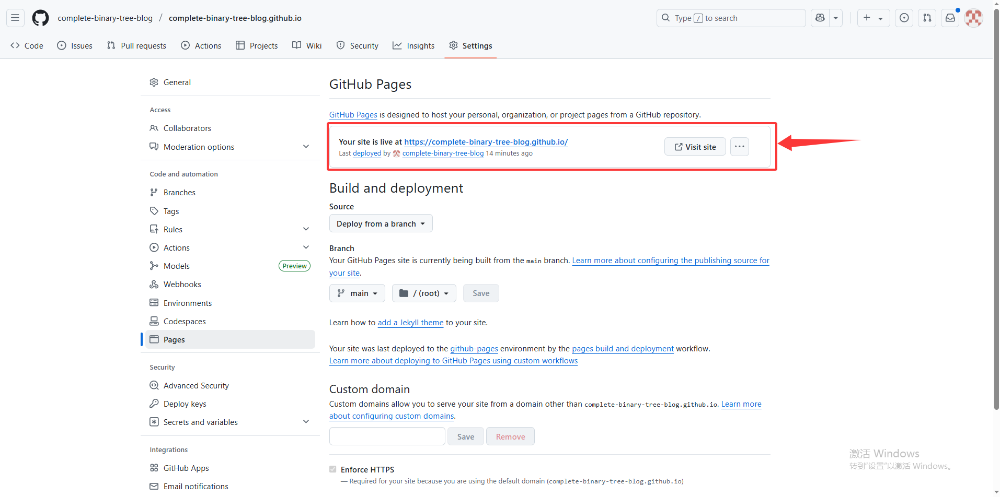

如果出现了你在本地运行 `mkdocs serve` 一样的页面，恭喜你，成功了！
